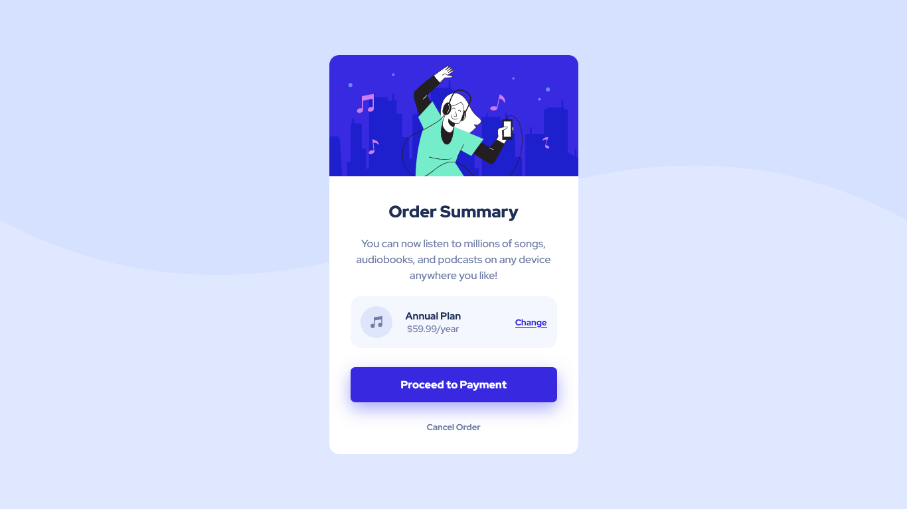

# Frontend Mentor - Order summary card solution

This is a solution to the [Order summary card challenge on Frontend Mentor](https://www.frontendmentor.io/challenges/order-summary-component-QlPmajDUj). Frontend Mentor challenges help you improve your coding skills by building realistic projects. 

## Table of contents

- [Overview](#overview)
  
  - [The challenge](#the-challenge)
  - [Screenshot](#screenshot)
  - [Links](#links)
  
- [My process](#my-process)
  - [Built with](#built-with)
  
  

## Overview

### The challenge

Users should be able to:

- See hover states for interactive elements

## Screenshot

### Mobile Solution (375px width)

### Desktop Solution (1366px width)

### Links

-  [Solution URL](https://github.com/AchrefFast/Frontend-Mentor--NFT-preview-card-componen)
- [Live Site URL](https://achreffast.github.io/Frontend-Mentor--NFT-preview-card-componen/)

## My process

### Built with

- Semantic HTML5 markup
- SASS Variables
-  SVGs
- CSS Grid
- Flexbox

## Author

- Frontend Mentor - [@AchrefFast](https://www.frontendmentor.io/profile/AchrefFast)
